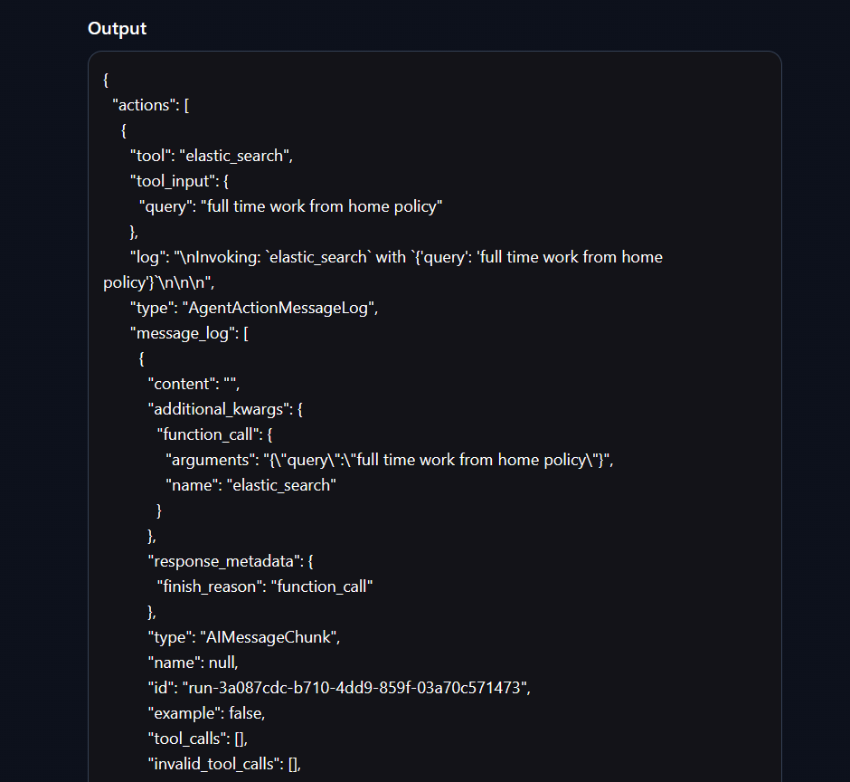

# Langchain+Prompty+ElasticSearch


## How to run locally

### Prerequisite
In order to host this app, you need to have:

- A valid Elastic Search account
- An Azure OpenAI endpoint with two deployments: one GPT deployment for chat and one embedding deployment for embedding.
- A created index in your Elastic Search account consistent with the index name in `test-app\packages\openai-functions-agent\openai_functions_agent\agent.py`. By default it is called `langchain-test-index`
- Put the data you want Elastic Search work with in `test-app\packages\openai-functions-agent\openai_functions_agent\data` folder and change the data file name in `agent.py` (change the `local_load` settings as well)
- Create and save your elastic search api key. Remember to pass the encoded key to the environment variables.


### dependency requirements:

- Python=3.11
- poetry==1.6.1

### go to `test-app` folder and do followings:

1. use poetry to install all dependency
`RUN poetry install --no-interaction --no-ansi`

1. set environment variables(on Windows)

```ps1
$Env:AZURE_OPENAI_ENDPOINT= <your aoai endpoint>
$Env:OPENAI_API_VERSION= <your aoai api version>
$Env:AZURE_DEPLOYMENT= <your aoai deployment name for chat>
$Env:AZURE_OPENAI_EMBEDDING_DEPLOYMENT= <your aoai deployment name for embedding>
$Env:ELASTICSEARCH_ENDPOINT= <Your Elastic Search Endpoint>
$Env:ELASTICSEARCH_API_KEY= <Your Elastic Search API>
```

3. Now try to run it on your local
`langchian serve`

1. you can go to http://localhost:8000/openai-functions-agent/playground/ to test.

1. you can mention your index in `input` to tell agent to use search tool.
e.g. 


## deploy to MIR using azd
 
 1. set more environment variables

 ```ps1
$Env:AZURE_SUBSCRIPTION_ID= <Your AZURE_SUBSCRIPTION_ID>
$Env:AZURE_RESOURCE_GROUP= <Your AZURE_RESOURCE_GROUP>
$Env:AZURE_WORKSPACE_NAME=<Your AZURE_WORKSPACE_NAME>
$Env:AZUREAI_ENDPOINT_NAME=<Your AZUREAI_ENDPOINT_NAME>
$Env:AZUREAI_DEPLOYMENT_NAME=<Your AZUREAI_DEPLOYMENT_NAME>
 ```

2. Do azd initiation.
`azd init` under the main folder.

3. Deploy to MIR
`azd up` under the main folder.

4. Talk to your agent
please take the `validate_deployment.ipynb` as reference.

